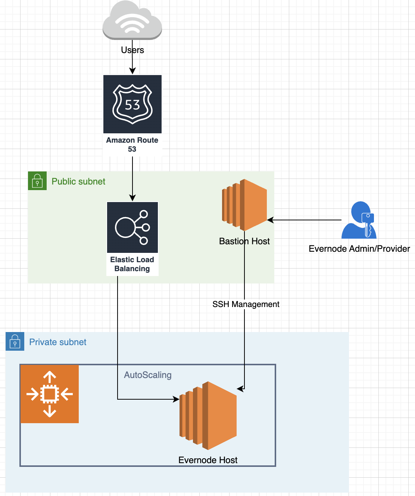

# Implementing Automation for Evernode Host Infrastructures Deployment within the AWS Ecosystem
This repository contains the automation scripts for deploying the Evernode Host operator on AWS using the Infrastructure as Code (IaC) approach with AWS CDK.

### NOTE  
This module is responsible for setting up the necessary infrastructure resources but does not include automation for the Evernode host configuration. In simpler terms, this module can prepare and allocate the necessary infrastructure, but it does not handle the automatic setup of the Evernode host.


# The AWS infrastructure architecture for Evernode Hosting on AWS
The following diagram illustrates how to host an Evernode host node on Amazon Web Services (AWS).




## Prerequisites
Before deploying to AWS, make sure you have completed the following steps:

1. You have an AWS account and have created AWS IAM Programmatic Access from your computer.
2. You have a public domain name created using AWS Route 53. docs.aws.amazon.com
3. AWS CLI is installed and configured with the Programmatic Access key created above. docs.aws.amazon.com  
4. Create a SSH Key pair from the AWS console for host access over SSH from your computer
4. NodeJS and AWS CDK tool is installed on your computer.

## Deployment 

1. Clone the repository 
2. Go to this path: cloud-infra-deployment-automation/aws/bin
3. Open evernodehost.ts file and modify the value according to your AWS environment: 
```typescript 
let variables = {
    ZONE_NAME: "HOSTED ZONE NAME", 
    ZONE_ID: "HOSTED ZONE ID", 
    OS_SPECIFICATION: {
      region: 'us-east-1', 
      image_id: "ami-053b0d53c279acc90" // This IMAGE ID will change on the AWS region that you're deploying from
    }, 
    ssh_key_name: "the ssh key name that you created as part of the pre-requisite steps"
}
```

4. Once you finished adjusting, change the directory back to cloud-infra-deployment-automation/aws and run the follwoing command
```bash 
    $ npm install -g aws-cdk
    $ cd evernode-host/cloud-infra-deployment-automation
    $ npm install
    $ cdk synth
    $ cdk deploy
    

```
5. You should now have Evernode host resources deployed 

6. Then, if no longer needed, to dispose of the evernode host resources afterwards
```bash 
    cdk destroy
```

# [NOTE] 

## To deploy the Evernode stack, you need to have prior experience with AWS Environment and understand TypeScript and AWS CDK tool. Here's a brief overview of what you need to know:

AWS Environment: You should be familiar with setting up and managing AWS environments. This includes understanding how to set up AWS accounts, regions, and how to use environment variables for deployment. You'll need to declare your stack's environment, which can be done using AWS CDK's Environment class, where you specify the account and region for your stack docs.aws.amazon.com.
TypeScript: Evernode is built with TypeScript, so you should have a solid understanding of the language. This includes knowledge of TypeScript's syntax, data types, functions, classes, and modules.
AWS CDK Tool: AWS CDK (Cloud Development Kit) is an open-source software development framework to define cloud infrastructure in code and provision it through AWS CloudFormation. You need to understand how to use AWS CDK to define AWS resources and how to deploy these resources using the AWS CDK tool. This includes creating a new AWS CDK project, defining AWS resources in your project, and deploying your project to AWS docs.aws.amazon.com.
By deploying the infrastructure stacks for Evernode, you will incur AWS infrastructure usage costs. These costs will depend on the resources you deploy and their usage. It's important to monitor your AWS usage and costs to avoid unexpected charges. AWS provides tools and features to help you manage and monitor your AWS costs, including AWS Cost Explorer and AWS Budgets aws.amazon.com.

Please note that this is a high-level overview. Depending on your specific needs and the complexity of your deployment, you might need additional knowledge and skills.


This commit introduces a feature that enables automated deployment of Evernode host infrastructures in AWS platform using AWS CDK, a DevOps tool written in TypeScript. Please reach out to me at ishwolab@gmail.com if you have any questions regarding this feature.