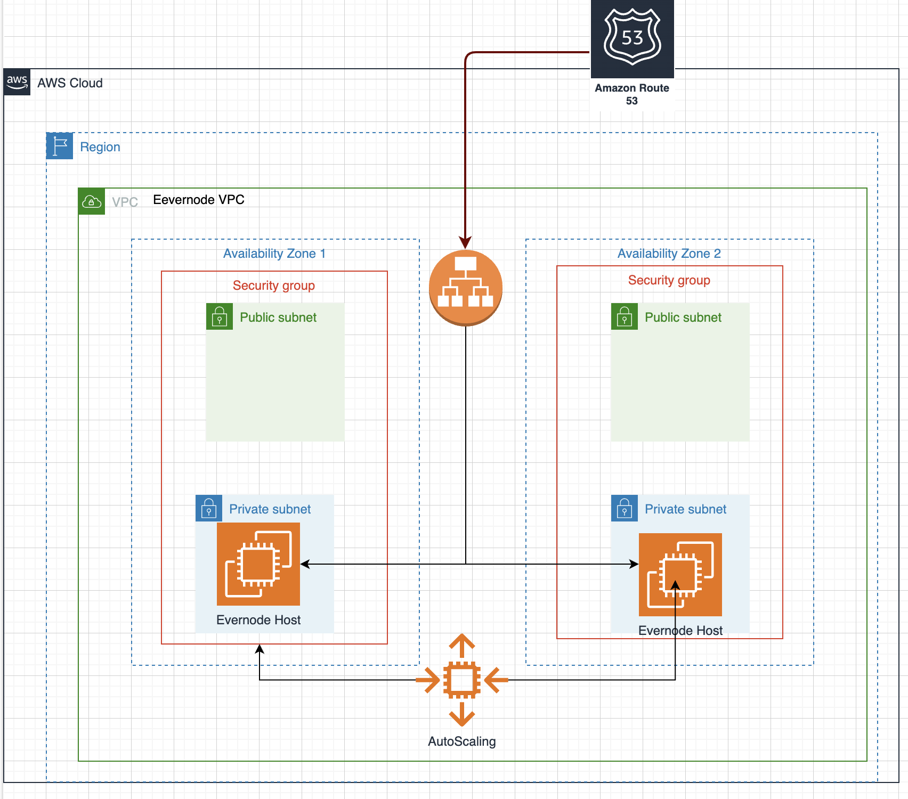

# Automating Evernode Host Provisioning in AWS
This repository contains the automation scripts for deploying the Evernode Host operator on AWS using the Infrastructure as Code (IaC) approach with AWS CDK.

The `cdk.json` file tells the CDK Toolkit how to execute your app.

## Useful commands

* `npm run build`   compile typescript to js
* `npm run watch`   watch for changes and compile
* `npm run test`    perform the jest unit tests
* `cdk deploy`      deploy this stack to your default AWS account/region
* `cdk diff`        compare deployed stack with current state
* `cdk synth`       emits the synthesized CloudFormation template

# Evernode Host Architecture Diagram in AWS
The following diagram illustrates how to host an Evernode host node on Amazon Web Services (AWS).

